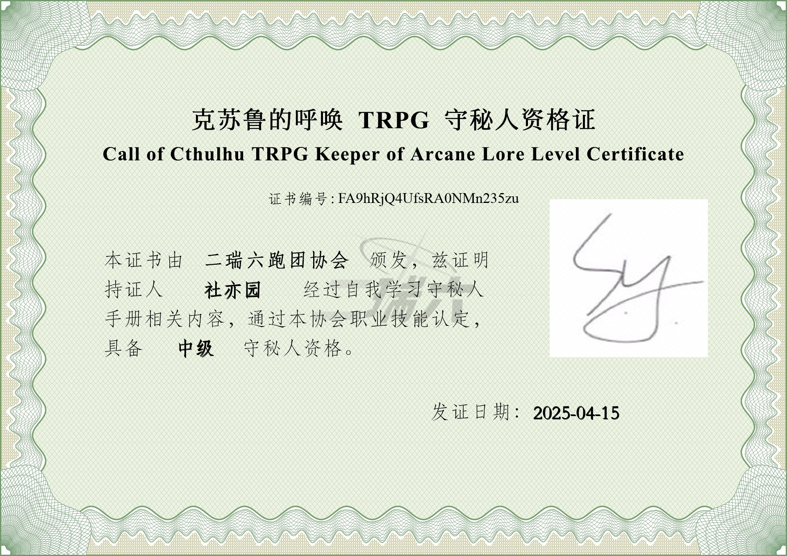
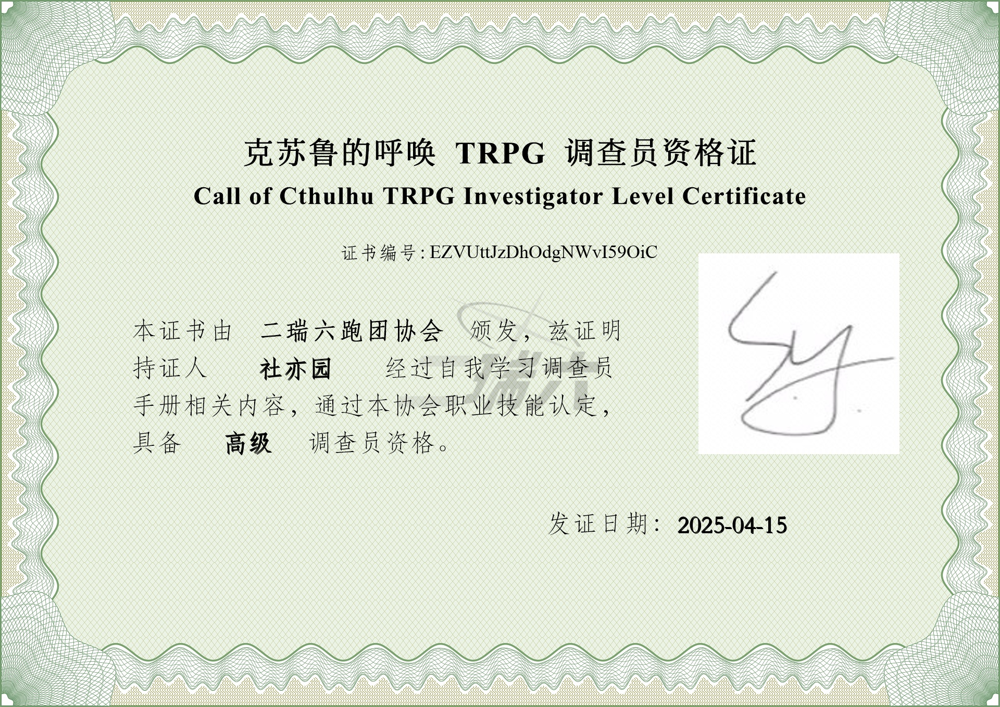
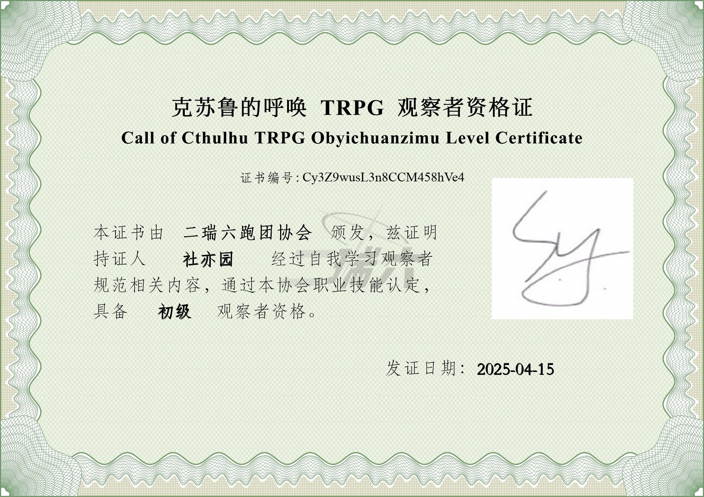
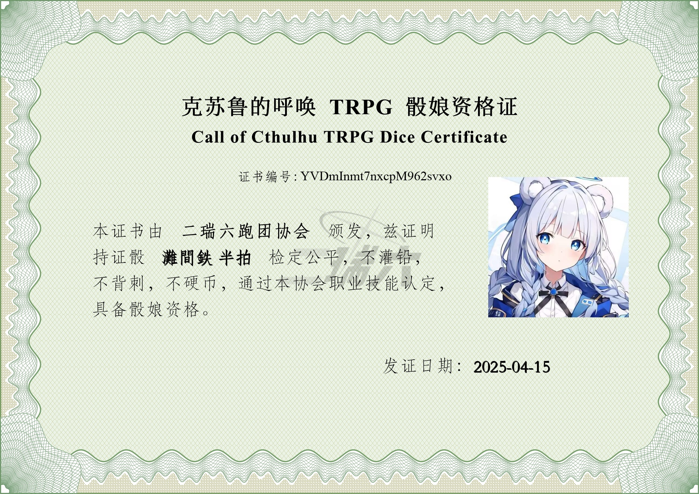

# KP_License 
在线生成kp资格证，pl再也不用担心我无证上岗了！

---

## 项目介绍
你还在因为没有办法考取kp资格证而发愁吗？

还在因为没有pl证而不能跑团而心痛吗？

还在因为没有ob资格证无法第一时间观摩自己喜欢的瓜尔苦恼吗？

还在因为骰子没有资格证不能上岗忧郁吗？

没关系，KP_License 为你解决这些问题！

KP_License 是一个在线生成各种coc相关许可证的api项目，你可以通过访问该项目的api来生成各种coc相关许可证图片，并返回cq码支持的静态图片url。

> 以上内容纯属瞎扯，仅供娱乐，与任何现实中的人或事件无关。如有雷同，纯属巧合。

## 效果展示

1. 生成kp证书

2. 生成pl证书

3. 生成ob证书

4. 生成骰子证书



## 项目需求：
- *python 3.10+*

## 如何部署？

1. 将项目仓库克隆到本地
```bash
git clone https://github.com/Sheyiyuan/KP_License.git
```
2. 安装依赖
```bash
# 创建虚拟环境
python -m venv .venv
# 激活虚拟环境
source .venv/bin/activate
# 安装依赖
pip install --upgrade pip
pip install -r requirements.txt
```
3. 初始化项目
```bash
python main.py
```
在第一次运行时，KP_License 会自动初始化项目，包括创建数据库表、配置文件等。

在运行后先退出程序，然后修改配置文件`data/conf/conf.json`，一般情况下只需修改`api`下的`domain`和`port`即可。

> **注意：出于安全考虑，这里配置文件中的`domain`字段会直接出现在返回的图片url中，如果你使用公网ip请不要将其暴露在公网上。**

4. 启动项目
```bash
python main.py
```

好了，现在可以开始使用了！

---

## API文档

### 生成证书
**请求方式：** `POST`

**请求地址：** `/license`

**请求参数：**

| 参数名    | 类型     | 是否必填 | 描述                                |
|--------|--------|------|-----------------------------------|
| option | string | 是    | 要执行的操作，目前仅支持`register`            |
| name   | string | 是    | 姓名,即证书上的名字                        |
| role   | string | 是    | 类型，在下面列表中选择：`kp`、`pl`、`ob`、`dice` |
| level  | number | 是    | 等级，1代表初级，2代表中级，3代表高级 此参数对骰子无效     |
| qq     | string | 是    | qq号,用于获取头像                        |

**返回参数：**

| 参数名  | 类型     | 描述                   |
|------|--------|----------------------|
| code | number | 状态码，200代表成功，其他情况代表失败 |
| msg  | string | 错误信息                 |
| data | object | 数据                   |

**data(obj)的内容：**

| 参数名          | 类型     | 描述            |
|--------------|--------|---------------|
| img_url      | string | 图片url,有效时间1分钟 |
| data.img_url | string | 图片url,有效时间1分钟 |

### api体验地址
```angular2html
https://api.sheyiyuan.cn/kplicense/license/
```

---

目前项目还在开发中，后续会增加更多的功能。
如果有什么问题或者建议，欢迎提issue或者PR。